# 📑 Project Report

**Project Title:** Lecture Voice-to-Notes Generator

---

## 1. Introduction

Taking lecture notes manually can be time-consuming and prone to missing key points. This project automates the process of generating lecture notes by using **speech-to-text transcription**, **automatic summarization**, and **flashcard generation** with the help of modern AI models.

The application is built using **Streamlit** for a user-friendly web interface, and leverages **Whisper (OpenAI)** and **Hugging Face Transformers** for natural language processing tasks.

---

## 2. Objectives

* To record or upload lecture audio.
* To transcribe the audio into accurate text.
* To summarize the transcription into concise notes.
* To generate study flashcards (Q&A format) for revision.
* To allow exporting results in multiple formats (TXT, JSON, full report).

---

## 3. System Architecture

**Workflow:**

1. **Audio Input**

   * Users can record live audio or upload lecture files (MP3, WAV, WEBM, M4A).

2. **Transcription (Speech-to-Text)**

   * OpenAI **Whisper** model converts the lecture audio into text.

3. **Summarization**

   * Hugging Face **T5-small** model condenses long transcripts into concise summaries.

4. **Flashcard Generation**

   * Hugging Face **valhalla/t5-small-qg-hl** generates **questions** from key sentences.
   * Original sentences are used as **answers** to form flashcards.

5. **User Interface (Streamlit)**

   * Transcriptions, summaries, and flashcards are displayed.
   * Users can download results in **TXT/JSON** formats or export a full analysis report.

```mermaid
graph TD
    subgraph User Input
        A[🎤 Record Audio] --> C{Audio Data};
        B[📁 Upload Audio File] --> C;
    end

    subgraph Processing Pipeline
        C -- "Temporary File" --> D(Whisper Transcription);
        D -- "Full Text" --> E(Text Summarization);
        D -- "Full Text" --> F(Flashcard Generation);
    end

    subgraph Output
        G[📝 Full Transcription]
        H[📋 Concise Summary]
        I[🎯 Study Flashcards]
    end

    D --> G;
    E --> H;
    F --> I;
```

---

## 4. Tools and Technologies

| Workflow Step        | Library / Technology                          | LLM / Model                    | Purpose                                               | NLP Supported Library                   |
|---------------------|-----------------------------------------------|-------------------------------|-------------------------------------------------------|-----------------------------------------|
| Audio Input         | Streamlit, streamlit-mic-recorder             | —                             | UI, record/upload audio                               |                                         |
| Audio Format Handling | ffmpeg, os                                   | —                             | Convert/process various audio file types; cleanup      |                                         |
| File Processing     | tempfile, blobfile                            | —                             | Temporary file creation/storage                       |                                         |
| Timestamp / Reports | datetime                                      | —                             | Timestamp for file naming, report export              |                                         |
| Transcription       | openai-whisper, torch                         | Whisper (LLM)                 | Speech-to-text conversion                             |                                         |
| Summarization       | transformers (pipeline), tiktoken, sentencepiece | T5-small (Hugging Face LLM) | Extract key points, summarize text                    | transformers, tiktoken, sentencepiece   |
| Flashcard Generation| nltk, transformers QG, torch                  | valhalla/t5-small-qg-hl (LLM) | Tokenize, split, generate question-answer pairs       | nltk, transformers                      |
| Serialization       | json                                          | —                             | Exporting results and flashcards as .json data        |                                         |
| Result Output       | Streamlit (download, UI rendering), custom CSS| —                             | Display, download results visually and interactively  |                                         |
| Backend Model Execution | torch                                     | —                             | Core backend for all deep learning AI models          |                                         |

---

## 5. Features

* 🎙️ **Live Recording** via microphone.
* 📁 **Audio File Upload** (MP3, WAV, M4A, WEBM).
* ⏳ **Automatic Transcription** using Whisper.
* 📋 **Summarized Notes** generated by T5 model.
* 🎯 **Flashcards for Study** with question-answer format.
* 📥 **Download Options** – TXT, JSON, Full Report.
* 🎨 **Custom UI Styling** with responsive design.

---

## 6. Advantages

* Saves time and effort in manual note-taking.
* Provides **concise summaries** for quick revision.
* Enhances learning with **auto-generated flashcards**.
* Works with both **live lectures** and **uploaded recordings**.

---

## 7. Limitations

* Whisper **base model** may not be 100% accurate for noisy audio.
* Summaries and flashcards depend on the quality of transcription.
* Requires internet & sufficient system resources (CPU/GPU).

---

## 8. Future Enhancements

* Support for **multi-language transcription**.
* Option to choose **different summarization styles** (detailed, bullet points, etc.).
* Integration with **cloud storage** (Google Drive, OneDrive).
* Personalized **quiz mode** from flashcards.

---

## 9. Conclusion

The **Lecture Voice-to-Notes Generator** successfully combines **speech recognition** and **natural language processing** to assist students and professionals in creating structured lecture notes. By automating transcription, summarization, and flashcard generation, it makes learning more efficient and interactive.

---

## 10. References

* OpenAI Whisper: [https://github.com/openai/whisper](https://github.com/openai/whisper)
* Hugging Face Transformers: [https://huggingface.co/models](https://huggingface.co/models)
* Streamlit Documentation: [https://docs.streamlit.io](https://docs.streamlit.io)

---
